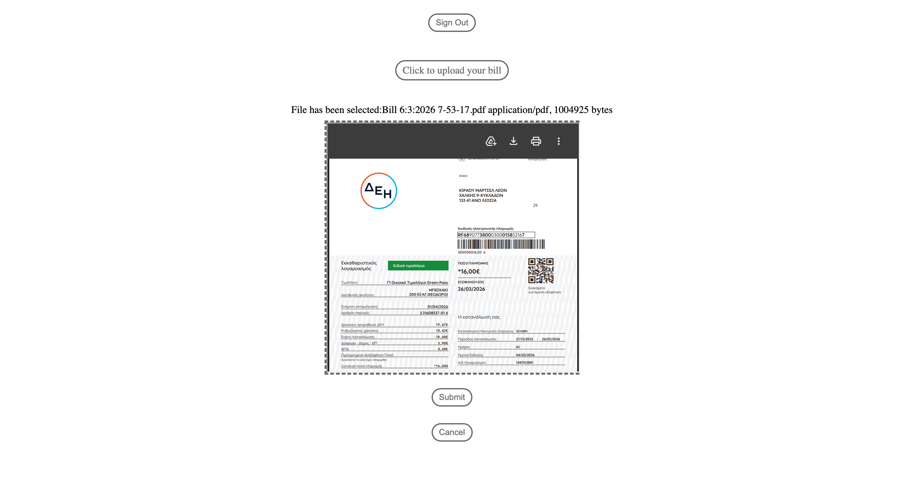
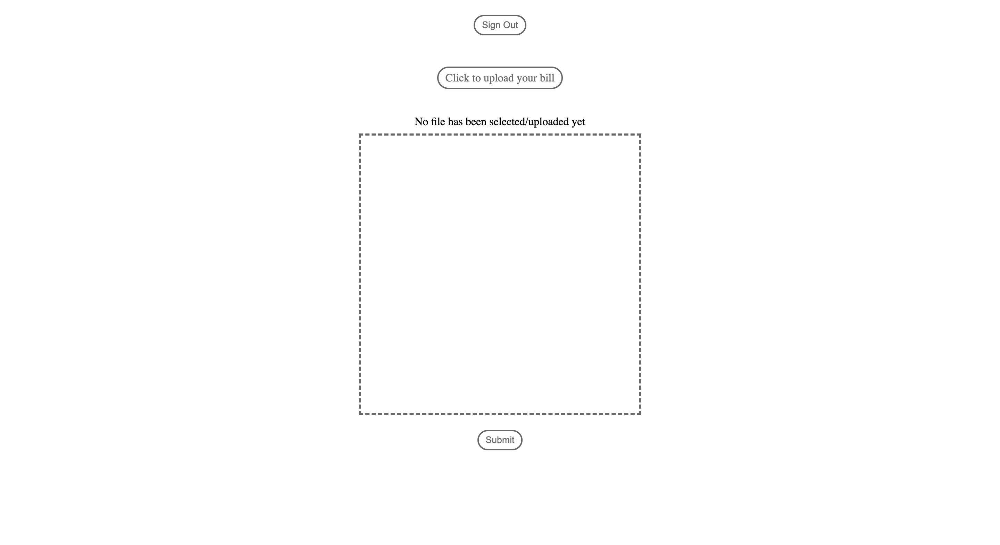
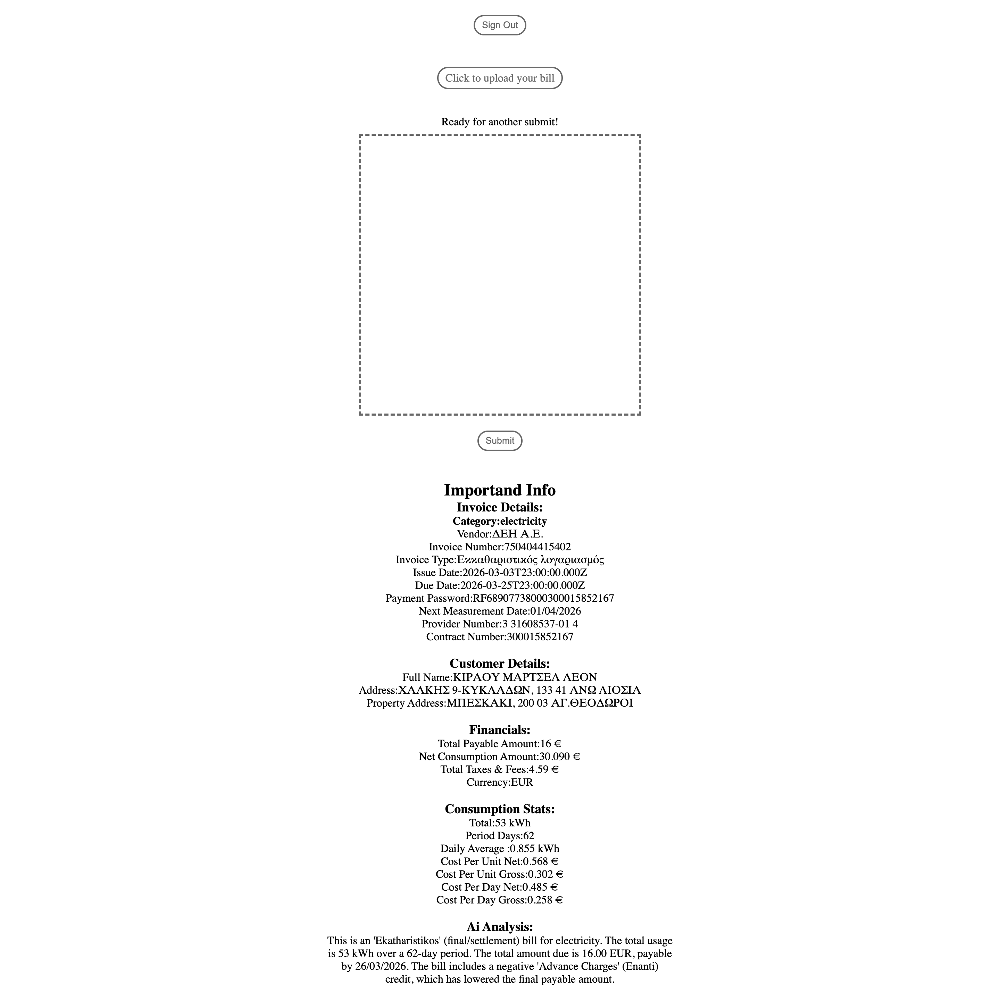

# Project Title: BillBreeze
User uploads utility bill like electricity,water,telecom and internet and ai extracts data from them. It saves time, there is ability to organize further the bills and  user gains financial insights without manual data entry.

## Tech Stack:
* Frontend: Vanilla Javascript , HTML and CSS, no framework.
* Backend: Node.js with Express.js as framework.
* AI/LLM:GoogleGenAI with configurable model because i am on free tier, so currently i use  gemini-2.5-flash.
* Database: MongoDB.
* Cloud/Auth: Firebase/Firestore

## Tech stack

- **Frontend**: Vanilla JavaScript, HTML, CSS (no framework)
- **Backend**: Node.js + Express
- **AI/LLM**: Google Gemini via `@google/genai` (model is configurable; current default is set in `backend/src/aiClient.js`)
- **Database**: MongoDB (Mongoose)
- **Auth + file storage**: Firebase Auth + Firebase Storage (bill images are stored in Storage)

## Getting started

### Requirements

- Node.js (recommended: latest LTS)
- A MongoDB database (Atlas or self-hosted)
- A Firebase project (Auth + Storage enabled)
- A Gemini API key (Google AI Studio)

### 1) Clone the repo

```bash
git clone https://github.com/MarceloChirau/bill-breeze.git
cd bill-breeze
```

### 2) Install dependencies

Root dependencies:

```bash
npm install
```

Backend dependencies:

```bash
cd backend
npm install
```

### 3) Environment variables

This project uses **two** env files:

- **Frontend**: `./.env`
- **Backend**: `./backend/.env`

#### Frontend env (`.env`)

These values come from your Firebase Web App config.

```bash
# Firebase web app config
APP_ID="YOUR_FIREBASE_APP_ID"
APP_NICKNAME="bill-breeze"
PROJECT_ID="YOUR_FIREBASE_PROJECT_ID"
PROJECT_NUMBER="YOUR_FIREBASE_PROJECT_NUMBER"

# Optional (only if you use Facebook auth)
FACEBOOK_REDIRECT_URI="https://YOUR_PROJECT.firebaseapp.com/__/auth/handler"
```

#### Backend env (`backend/.env`)

```bash
PORT=3000

# MongoDB connection string (Atlas recommended)
MONGO_DB_LINK="mongodb+srv://<username>:<password>@<cluster>/<db>?retryWrites=true&w=majority"

# Gemini API key
GEMINI_API_KEY="YOUR_GEMINI_API_KEY"
```

### 4) Run the backend

From `bill-breeze/backend`:

```bash
npm run dev
```

The backend runs on `http://localhost:3000`.

## How it works



1. **Auth**: User signs in with Firebase Auth.
2. **Upload**: The bill file is uploaded to **Firebase Storage** under a user-scoped path like `users/{uid}/...`.
3. **Extract**: Frontend calls `POST /v1/api/ai/extract-bill` with `{ "storagePath": "..." }`. The backend downloads the file from Storage and sends it to Gemini with strict JSON extraction instructions.
4. **Render**: The frontend renders the extracted JSON in the UI.
5. **Persist**: Parsed bill data can be stored in MongoDB for later browsing and analytics.

## Screenshots

### Dashboard preview



### User Uploads Utility bill


###### Output 


###### Live Demo:
**Visit BillBreeze on Render**
[BillBreeze](https://bill-breeze.onrender.com)
**Note** This project is hosted on Render's free tier. If the site has been inactive, it may take 30-60 seconds for the server to wake up when you first visit.Please be patient while it initializes!


